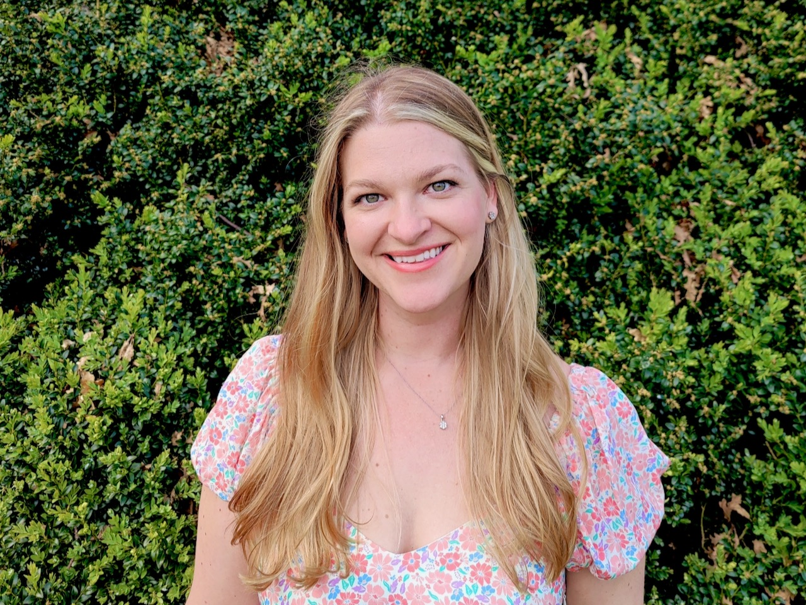

</nobr>My name is Morgan Barnes </nobr> and I am currently a PhD student at Rice University in the Materials Science and NanoEngineering department and am a member of the [Verduzco Polymer lab](http://verduzcolab.blogs.rice.edu/).

Polymers are ubiquitous in our lives from the toothbrushes we use, the fabrics we wear and the chairs we sit in. From their conception, isotropic polymers have played a large role in everyday household items and manufacturing because of their low weight and costs. However, as technologies advanced the need for multi-functional materials that exhibit unique mechanical, electrical and optical properties has emerged. These properties are often only available in highly anisotropic polymers. 

The focus of my research is to develop these novel multi-functional anisotropic polymers. Specifically I work with liquid crystal elastomers (LCEs) to create reversible shape-shifting soft materials and covalent organic frameworks (COFs) to make strong, tough films. Both LCEs and COF films have promising applications, including soft-robotics, biomedical devices, and ulta-light weight armor.

I have mentored many students and teachers in the laboratory for research projects and regularly give lectures and lab tours to many different groups that visit Rice. Feel free to contact me with any questions about my work or research in general!

 
