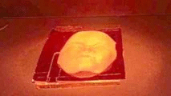

# Liquid Crystal Elastomers
I am interested in liquid crystal elasotmers (LCEs) which are soft polymers than can reversibly shape-shift when expsed to a variety of stimuli includng heat, light, or electric/magnetic fields. As such, LCEs are promising materials for a variety of applications including soft-robotics, biomedical devices, and microfluidics. Actuation, or shape-shifting, arises from from the coupled anisotropy of liquid crystalline (LC) monomers to the polymer network at low temperatures. As the temperature incresases the order parameter, or overall director alignment of the LCs, is greatly reduced as the LCE transitions to an isotropic state and the anisotropy is recovered as the LCE cools. Depending on the overall LC director profile, the LCE can undergo complex, reversible shape changes when heated and cooled. 

Specifically, I am focused on developing new techniques to easily program arbitrary shape changes into LCEs and exploring the physical relationship of the LC monomers to the chain extenders and the crosslinkers in the elastomer network. My goal is to optomize current LCE synthesis techniques to develop a library of LCEs that can undergo complex shape changes in response to a variety of actuating temperatures and stimuli. Research Supported by the Army Research Office (W911NF1810289) from the [Verduzco Laboratory](http://verduzcolab.blogs.rice.edu/). Publications: [DOI: 10.1039/C8SM02174K
](https://pubs.rsc.org/en/content/articlelanding/2018/sm/c8sm02174k#!divAbstract) and [DOI: 10.1016/j.snb.2016.12.141](https://www.sciencedirect.com/science/article/pii/S0925400516321128).

	

        
	

	

        
    

	

        
	

# 2D Covalent Organic Frameworks

Additionally, I am working to develop and synthesize new 2D covalent organic framework (COF) films. COFs are inherently crystalline and porous materials due to their molecular building blocks and are widely studied for catalysis and filtration applications because of their large surface areas. However, I am interested in synthesizing high-strength high-toughness 2D COF films with inter-layer hydrogen bonding. These polymers films have the potential to replace current high-performance polymers such as Kevlar. This work combines organic synthesis, exploring novel processing methods, and mechanical characterization and is supported by and in collaboration with the Army Research Laboratory (W911NF-18-0062). 

	

        
	

	

        
    

	

        
	

