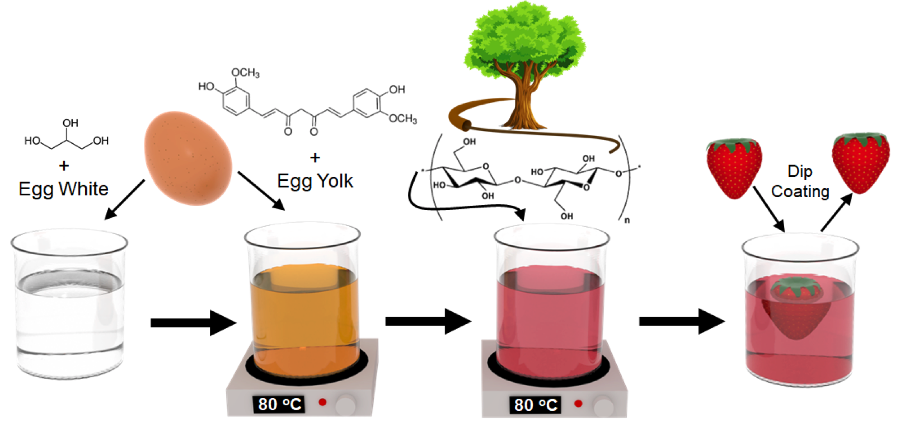

<ol reversed class = "tab">

 <li>A. Khater, S. Bhattacharyya, M. Saadi, <b>M. Barnes</b>, M. Lou, V. Harikrishnan, S.M. Sajadi, P.J. Boul, C.S. Tiwary, H, Zhu, M.M. Rahman, P. Ajayan. <i>Processing Dynamics of 3D-Printed Carbon Nanotubes-Epoxy Composites</i>. Submitted. <a href="https://arxiv.org/abs/2103.02672">arxiv</a>.
     
<li>S. Susarla, G. Chilkoor, Y. Cui, T. Arif, A. Puthirath, T. Tsafack, P. Sudeep, S. Castro-Pardo, <b>M. Barnes</b>, R. Verduzco, N. Koratkar, T. Filleter, G. Venkataramana, M. Rahman, P. Ajayan. <i>Corrosion Resistance of Sulfur-Selenium Alloy Coatings</i>. Submitted. 2019.  <a href="https://arxiv.org/abs/2009.02451">arxiv</a>.

<li>D. Zhu, Z. Hu, T. K. Rogers, <b>M. Barnes</b>, C. Tseng, H. Mei, L. M. Sassi, Z. Zhang, M. M. Rahman, P. M. Ajayan, R. Verduzco, <i>Patterning, Transfer, and Tensile Testing of Covalent Organic Framework Films with Nanoscale Thickness.</i> Chem. Mater. 2021, <a href="https://pubs.acs.org/doi/abs/10.1021/acs.chemmater.1c01179">DOI: 10.1021/acs.chemmater.1c01179</a>. 

    

	
<li>D. Zhu, G. Xu, <b>M. Barnes</b>, Y. Li, C. P. Tseng, Z. Zhang, J. J. Zhang, Y. Zhu, S. Khalil, M. M. Rahman, R. Verduzco, P. M. Ajayan, <i>Covalent Organic Frameworks for Batteries</i>. Adv. Funct. Mater. 2021, <a href="https://onlinelibrary.wiley.com/doi/full/10.1002/adfm.202100505">DOI: 10.1002/adfm.202100505</a>. 

    

	
 <li>D. Zhu, Y. Zhu, Q. Yan, <b>M. Barnes</b>, F. Liu, P. Yu, C.-P. Tseng, N. Tjahjono, P.-C. Huang, M. M. Rahman, E. Egap, P. M. Ajayan, R. Verduzco. <i>Pure Crystalline Covalent Organic Framework Aerogels</i>. Chem. Mater. 2021, <a href="https://pubs.acs.org/doi/abs/10.1021/acs.chemmater.1c01122">DOI: 10.1021/acs.chemmater.1c01122</a>, Featured in: <a href="https://news.rice.edu/2021/06/07/absorbent-aerogels-show-some-muscle-2/">Rice News</a> 

    

	 
<li>D. Zhu, Z. Zhang, Y. Li, <b>M. Barnes</b>, S. Khalil, M.M. Rahman, P. Ajayan, R. Verduzco. <i>Rapid, Ambient Temperature Synthesis of Imine Covalent Organic Frameworks Catalyzed by Transition Metal Nitrates</i>. Chem. Mater. 2021, <a href="https://pubs.acs.org/doi/10.1021/acs.chemmater.1c00737">DOI: 10.1021/acs.chemmater.1c00737</a>.

    

	
<li>D. Zhu, X. Li, Y. Li, <b>M. Barnes</b>, C. Tseng, S. Khalil, M.M. Rahman, P. Ajayan, R. Verduzco. <i>Transformation of One-Dimensional Linear Polymers into Two-Dimensional Covalent Organic Frameworks Through Sequential Reversible and Irreversible Chemistries</i>. Chem. Mater. 2020, <a href="https://pubs.acs.org/doi/abs/10.1021/acs.chemmater.0c04237"> DOI: 10.1021/acs.chemmater.0c04237</a>

    

	
<li><b>M. Barnes</b>, S. Sajadi, S. Parekh, M. M. Rahman, P. M. Ajayan, R. Verduzco, <i>Reactive 3D Printing of Shape Programmable Liquid Crystal Elastomer Actuators</i>. ACS Appl. Mater. Interfaces 2020, <a href="https://pubs.acs.org/doi/10.1021/acsami.0c07331">DOI: 10.1021/acsami.0c07331</a>, Featured in: <a href="https://news.rice.edu/2020/06/09/lab-makes-4d-printing-more-practical/">Rice News</a> 

	

        
    	

	

        

            <iframe src="https://www.youtube.com/embed/H6SYLFtoS8Y" frameborder="0" allow="accelerometer; autoplay; encrypted-media; gyroscope; picture-in-picture" allowfullscreen></iframe>
        

    	

     
<li>S. Jung, Y. Cui, <b>M. Barnes</b>, C. Satam, S. Zhang, R. A. Chowdhury, A. Adumbumkulath, O. Sahin, C. Miller, S. M. Sajadi, L. M. Sassi, Y. Ji, M. R. Bennett, M. Yu, J. Friguglietti, F. A. Merchant, R. Verduzco, S. Roy, R. Vajtai, J. C. Meredith, J. P. Youngblood, N. Koratkar, M. M. Rahman, P. M. Ajayan, <i>Multifunctional Bio-Nanocomposite Coatings for Perishable Fruits</i>. Advanced Materials 2020. <a href="https://onlinelibrary.wiley.com/doi/epdf/10.1002/adma.201908291">DOI: 10.1002/adma.201908291</a>, Featured in: <a href="https://news.rice.edu/2020/06/04/egg-based-coating-preserves-fresh-produce/">Rice News</a> 

	

        
    	

	

        

            <iframe src="https://www.youtube.com/embed/dCSvs1_WgFg" frameborder="0" allow="accelerometer; autoplay; encrypted-media; gyroscope; picture-in-picture" allowfullscreen></iframe>
        

    	

     

<li>Rahman, M. M.; Puthirath, A. B.; Adumbumkulath, A.; Tsafack, T.; Robatjazi, H.; <b>Barnes, M.</b>; Wang, Z.; Kommandur, S.; Susarla, S.; Sajadi, S. M.; et al. <i>Fiber Reinforced Layered Dielectric Nanocomposite</i>. Advanced Functional Matererials 2019.<a 
href="https://onlinelibrary.wiley.com/doi/full/10.1002/adfm.201900056">DOI: 10.1002/adfm.201900056</a>, Featured in: <a href="https://msne.rice.edu/news/new-way-beat-heat-electronics/">Rice News</a> 

    

<li><b>Barnes</b>, Verduzco, <i>Direct Shape Programming of Liquid Crystal Elastomers</i>. Soft Matter 2019. <a href="https://pubs.rsc.org/en/content/articlelanding/2018/sm/c8sm02174k#!divAbstract/">DOI: 10.1039/C8SM02174K</a>, Featured in: <a href="http://news.rice.edu/2018/12/20/mighty-morphing-materials-take-complex-shapes/">Rice News</a>, <a href="https://cen.acs.org/materials/Programmable-polymer-forms-complex-shapes/97/i3">C&EN News</a>, and the Royal Society of Chemistry's <a href="https://www.chemistryworld.com/news/liquid-crystals-shape-up-on-demand/3009945.article">Chemistry World</a>

	

        
    

	

        

            <iframe src="https://www.youtube.com/embed/8RVlnatMPjc" frameborder="0" allow="accelerometer; autoplay; encrypted-media; gyroscope; picture-in-picture" allowfullscreen></iframe>
        

    

    

        

            <iframe src="https://www.youtube.com/embed/bmpVSqj2U2I" frameborder="0" allow="accelerometer; autoplay; encrypted-media; gyroscope; picture-in-picture" allowfullscreen></iframe>
        

    

<li>B. Zhu, <b>M. G. Barnes</b>, H. Kim, M. Yuan, H. Ardebili, and R. Verduzco, <i>Molecular engineering of step-growth liquid crystal elastomers</i>. Sensors Actuators B Chem., vol. 244, pp. 433440, 2017.  <a href="https://www.sciencedirect.com/science/article/pii/S0925400516321128/">DOI: 10.1016/j.snb.2016.12.141</a></li>

    

