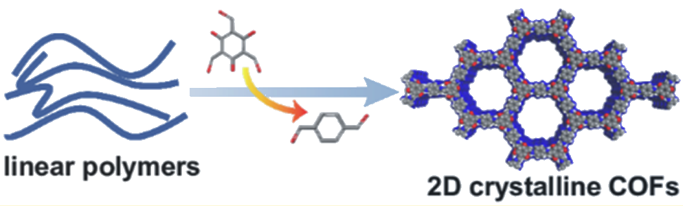
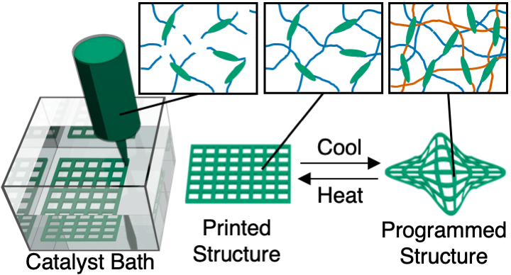
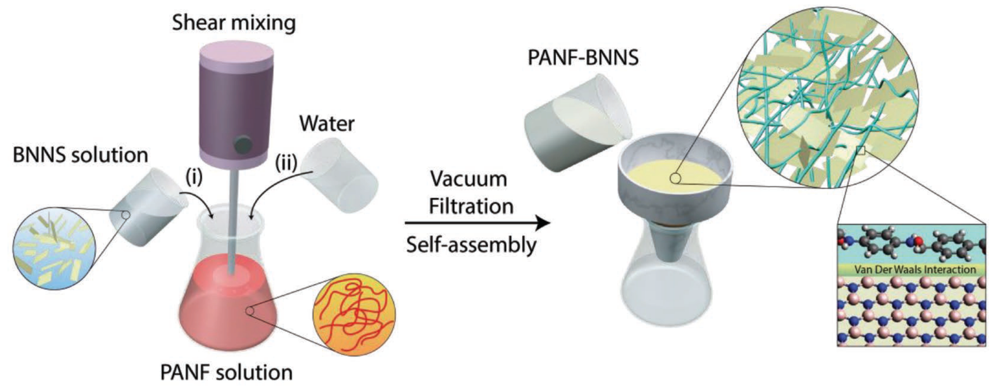

<ol reversed class = "tab">
		

<li>F. Fang, K. Dradrach, M. Zmyślony, <b>M. Barnes</b>, J. S. Biggins. <i></i>.<a href="https://www.researchgate.net/publication/373686077_Geometry_mechanics_and_actuation_of_intrinsically_curved_folds">Geometry, mechanics and actuation of intrinsically curved folds</a>. Submitted. 

    

<li> <b>M. Barnes</b>, F. Fang, J. Biggins. <a href="https://arxiv.org/abs/2303.07215">Surface instability in a nematic elastomer</a>. Accepted at PRL. 2023

    

<li>A. Khater, S. Bhattacharyya, M. Saadi, <b>M. Barnes</b>, M. Lou, V. Harikrishnan, S.M. Sajadi, P.J. Boul, C.S. Tiwary, H, Zhu, M.M. Rahman, P. Ajayan.<a href="https://www.sciencedirect.com/science/article/pii/S2666386423004307?via%3Dihub">Processing Dynamics of 3D-Printed Carbon Nanotubes-Epoxy Composites</a>. Cell Reports Physical Science. 2023

    

	
<li>A. Ajnsztajn, V. Harikrishnan, S. B. Alahakoon, D. Zhu, <b>M. Barnes</b>, J. Daum, J. Gayle, G. Tomur, J. Lowenstein, S. Roy, P. M. Ajayan, and R. Verduzco.<a href="https://chemistry-europe.onlinelibrary.wiley.com/doi/full/10.1002/chem.202302304">Synthesis and Additive Manufacturing of Hydrazone linked Covalent Organic Framework Aerogels</a>. Chem. Eur. J. 2023  

    

	
<li>S. Khalil, M. Meyer, M. Samani, C. Huang, <b>M. Barnes</b>, A. Marciel, R. Verduzco.<a href="https://pubs.acs.org/doi/full/10.1021/acsnano.2c08580">Enabling Solution Processible COFs through Suppression of Precipitation during Solvothermal Synthesis</a>. ACS Nano 2022.

    

<li><b>M. Barnes</b>, S. Cetinkaya, A. Ajnsztajn, R. Verduzco.<a href="https://pubs.rsc.org/en/content/articlelanding/2022/sm/d2sm00480a">Understanding the effect of liquid crystal content on the phase behavior and mechanical properties of liquid crystal elastomers</a>. Soft Matter 2022.

    

	
<li><b>M. Barnes</b>, D. C. Mcleod, R. H. Lambeth. <a href="https://pubs.acs.org/doi/10.1021/acsapm.1c01828?fig=tgr1&ref=pdf">Highly Crystalline Free-Standing Covalent Organic Framework Films Produced Directly from Monomer Solutions</a>. ACS Applied Material Interfaces 2022.

    

	
<li>S. Susarla, G. Chilkoor, Y. Cui, T. Arif, A. Puthirath, T. Tsafack, P. Sudeep, S. Castro-Pardo, <b>M. Barnes</b>, R. Verduzco, N. Koratkar, T. Filleter, G. Venkataramana, M. Rahman, P. Ajayan. <a href="https://onlinelibrary.wiley.com/doi/10.1002/adma.202104467">Corrosion Resistance of Sulfur-Selenium Alloy Coatings</a>. Advanced Materials 2021.

    

<li>D. Zhu, Z. Hu, T. K. Rogers, <b>M. Barnes</b>, C. Tseng, H. Mei, L. M. Sassi, Z. Zhang, M. M. Rahman, P. M. Ajayan, R. Verduzco, <a href="https://pubs.acs.org/doi/abs/10.1021/acs.chemmater.1c01179">Patterning, Transfer, and Tensile Testing of Covalent Organic Framework Films with Nanoscale Thickness</a>. Chem. Mater. 2021.

    

	
<li>D. Zhu, G. Xu, <b>M. Barnes</b>, Y. Li, C. P. Tseng, Z. Zhang, J. J. Zhang, Y. Zhu, S. Khalil, M. M. Rahman, R. Verduzco, P. M. Ajayan, <a href="https://onlinelibrary.wiley.com/doi/full/10.1002/adfm.202100505">Covalent Organic Frameworks for Batteries</a>. Advanced Functional Materials 2021.

    

	
 <li>D. Zhu, Y. Zhu, Q. Yan, <b>M. Barnes</b>, F. Liu, P. Yu, C.-P. Tseng, N. Tjahjono, P.-C. Huang, M. M. Rahman, E. Egap, P. M. Ajayan, R. Verduzco. <a href="https://pubs.acs.org/doi/abs/10.1021/acs.chemmater.1c01122">Pure Crystalline Covalent Organic Framework Aerogels</a>. Chemical Materials 2021. Featured in: <a.  href="https://news.rice.edu/2021/06/07/absorbent-aerogels-show-some-muscle-2/">Rice News</a> 

    

	 
<li>D. Zhu, Z. Zhang, Y. Li, <b>M. Barnes</b>, S. Khalil, M.M. Rahman, P. Ajayan, R. Verduzco. <a href="https://pubs.acs.org/doi/10.1021/acs.chemmater.1c00737"> Rapid, Ambient Temperature Synthesis of Imine Covalent Organic Frameworks Catalyzed by Transition Metal Nitrates</a>. Chemical Materials 2021.

    

	
<li>D. Zhu, X. Li, Y. Li, <b>M. Barnes</b>, C. Tseng, S. Khalil, M.M. Rahman, P. Ajayan, R. Verduzco. <a href="https://pubs.acs.org/doi/abs/10.1021/acs.chemmater.0c04237"> Transformation of One-Dimensional Linear Polymers into Two-Dimensional Covalent Organic Frameworks Through Sequential Reversible and Irreversible Chemistries</a>. Chemical Materials 2020.

    

	
<li><b>M. Barnes</b>, S. Sajadi, S. Parekh, M. M. Rahman, P. M. Ajayan, R. Verduzco, <a href="https://pubs.acs.org/doi/10.1021/acsami.0c07331">Reactive 3D Printing of Shape Programmable Liquid Crystal Elastomer Actuators</a>. ACS Applied Materials Interfaces 2020.  Featured in: <a href="https://news.rice.edu/2020/06/09/lab-makes-4d-printing-more-practical/">Rice News</a> 

	

        
    	

	

        

            <iframe src="https://www.youtube.com/embed/H6SYLFtoS8Y" frameborder="0" allow="accelerometer; autoplay; encrypted-media; gyroscope; picture-in-picture" allowfullscreen></iframe>
        

    	

     
<li>S. Jung, Y. Cui, <b>M. Barnes</b>, C. Satam, S. Zhang, R. A. Chowdhury, A. Adumbumkulath, O. Sahin, C. Miller, S. M. Sajadi, L. M. Sassi, Y. Ji, M. R. Bennett, M. Yu, J. Friguglietti, F. A. Merchant, R. Verduzco, S. Roy, R. Vajtai, J. C. Meredith, J. P. Youngblood, N. Koratkar, M. M. Rahman, P. M. Ajayan, <a href="https://onlinelibrary.wiley.com/doi/epdf/10.1002/adma.201908291">Multifunctional Bio-Nanocomposite Coatings for Perishable Fruits</a>. Advanced Materials 2020. Featured in: <a href="https://news.rice.edu/2020/06/04/egg-based-coating-preserves-fresh-produce/">Rice News</a> 

	

        
    	

	

        

            <iframe src="https://www.youtube.com/embed/dCSvs1_WgFg" frameborder="0" allow="accelerometer; autoplay; encrypted-media; gyroscope; picture-in-picture" allowfullscreen></iframe>
        

    	

     

<li>M. M. Rahman, A. B. Puthirath, A. Adumbumkulath, T. Tsafack, H. Robatjazi, <b>M. Barnes</b>, Z. Wang, S. Kommandur, S. Susarla, S. M. Sajadi,  D. Salpekar, F. Yuan, G. Babu, K. Nomoto, S. Islam, R. Verduzco, S. Yee, H. G. Xing, P. M. Ajayan <a 
href="https://onlinelibrary.wiley.com/doi/full/10.1002/adfm.201900056">Fiber Reinforced Layered Dielectric Nanocomposite</a>. Advanced Functional Matererials 2019. Featured in: <a href="https://msne.rice.edu/news/new-way-beat-heat-electronics/">Rice News</a> 

    

<li><b>M. Barnes</b>,R. Verduzco, <a href="https://pubs.rsc.org/en/content/articlelanding/2018/sm/c8sm02174k#!divAbstract/">Direct Shape Programming of Liquid Crystal Elastomers</a>. Soft Matter 2019. Featured in: <a href="http://news.rice.edu/2018/12/20/mighty-morphing-materials-take-complex-shapes/">Rice News</a>, <a href="https://cen.acs.org/materials/Programmable-polymer-forms-complex-shapes/97/i3">C&EN News</a>, and the Royal Society of Chemistry's <a href="https://www.chemistryworld.com/news/liquid-crystals-shape-up-on-demand/3009945.article">Chemistry World</a>

	

        
    

	

        

            <iframe src="https://www.youtube.com/embed/8RVlnatMPjc" frameborder="0" allow="accelerometer; autoplay; encrypted-media; gyroscope; picture-in-picture" allowfullscreen></iframe>
        

    

    

        

            <iframe src="https://www.youtube.com/embed/bmpVSqj2U2I" frameborder="0" allow="accelerometer; autoplay; encrypted-media; gyroscope; picture-in-picture" allowfullscreen></iframe>
        

    

<li>B. Zhu, <b>M. G. Barnes</b>, H. Kim, M. Yuan, H. Ardebili, and R. Verduzco, <a href="https://www.sciencedirect.com/science/article/pii/S0925400516321128/">Molecular engineering of step-growth liquid crystal elastomers</a>. Sensors Actuators B Chemicals 2017.  </li>

    

